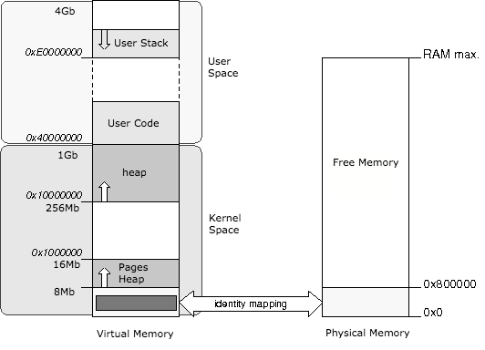

# 物理内存与虚拟内存管理

归功于 [GRUB](../Chapter-3/README.md) ，在启动后，内核可以知道可用物理内存的大小。

在实现操作系统时，前 8Mb 字节的物理内存将被内核保留使用，这些内存被用来存放：
- The kernel 内核
- GDT, IDT et TSS
- Kernel Stack 内核栈
- Some space reserved to hardware (video memory, ...) 保留硬件所需空间
- Page directory and pages table for the kernel 内核分页目录和分页表

剩下的内存开放给内核和应用程序。


### 虚拟内存映射

内存起始地址到 `0x40000000` 是内核空间， `0x40000000` 到结束留给用户空间。



虚拟内存中的 1Gb 内核空间，适用于所有任务（内核任务和用户任务）。

The kernel space in virtual memory, which is using 1Gb of virtual memory, is common to all tasks (kernel and user).

这是指向内核页目录的前256项任务页目录实现代码：(In [vmm.cc](https://github.com/SamyPesse/How-to-Make-a-Computer-Operating-System/blob/master/src/kernel/arch/x86/vmm.cc#L204)):

```cpp
/* 
 * Kernel Space. v_addr < USER_OFFSET are addressed by the kernel pages table
 */
pdir = (u32 *) pd->base->v_addr;
for (i=0; i<256; i++) 
    pdir[i] = pd0[i];	//pd0：内核页目录
```

#### 扩展资料
* [IDT:中断描述表](http://oss.org.cn/kernel-book/ch03/3.1.4.htm)
* [TSS:任务状态段-1](http://oss.org.cn/kernel-book/ch05/5.4.1.htm)
* [TSS:任务状态段-2](http://guojing.me/linux-kernel-architecture/posts/process-switch/)
* [Kernel Stack](http://oss.org.cn/kernel-book/ch04/4.4.1.htm)